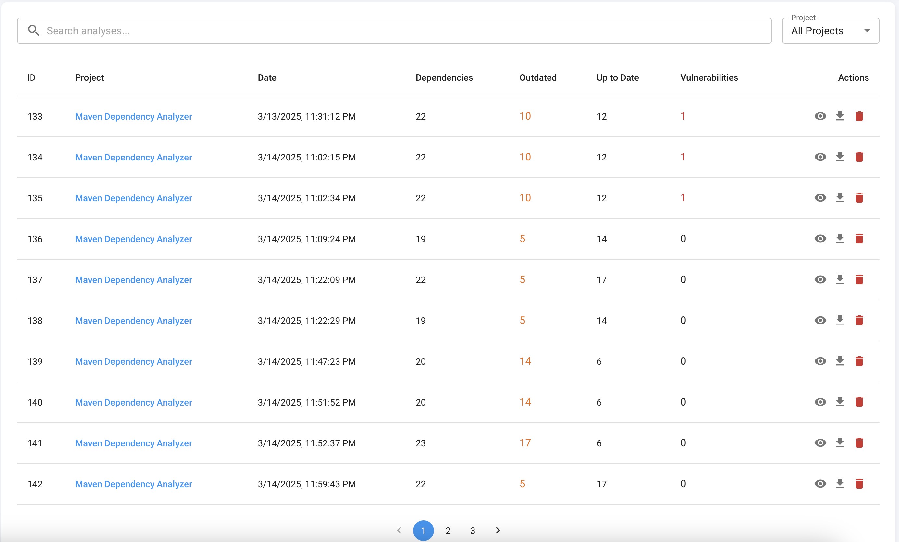
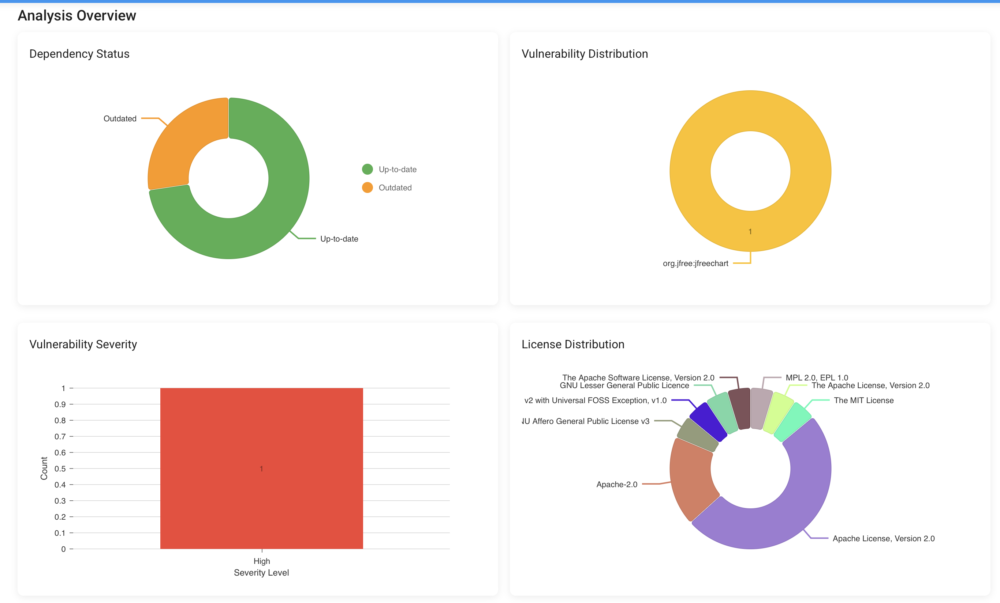
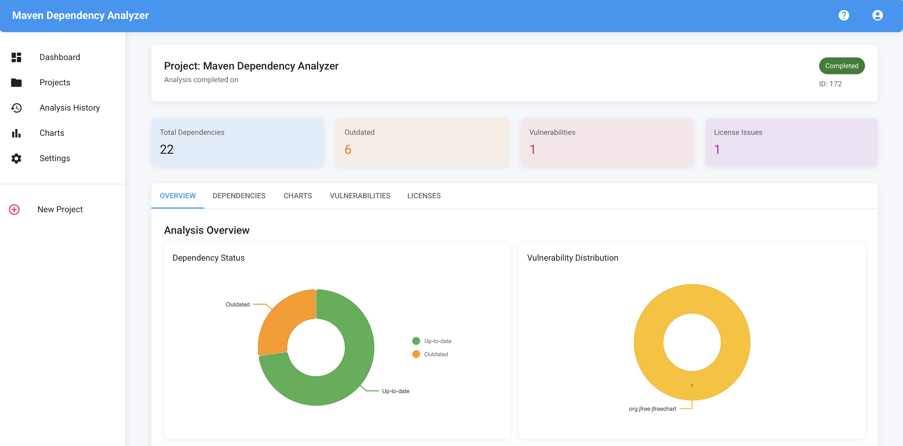
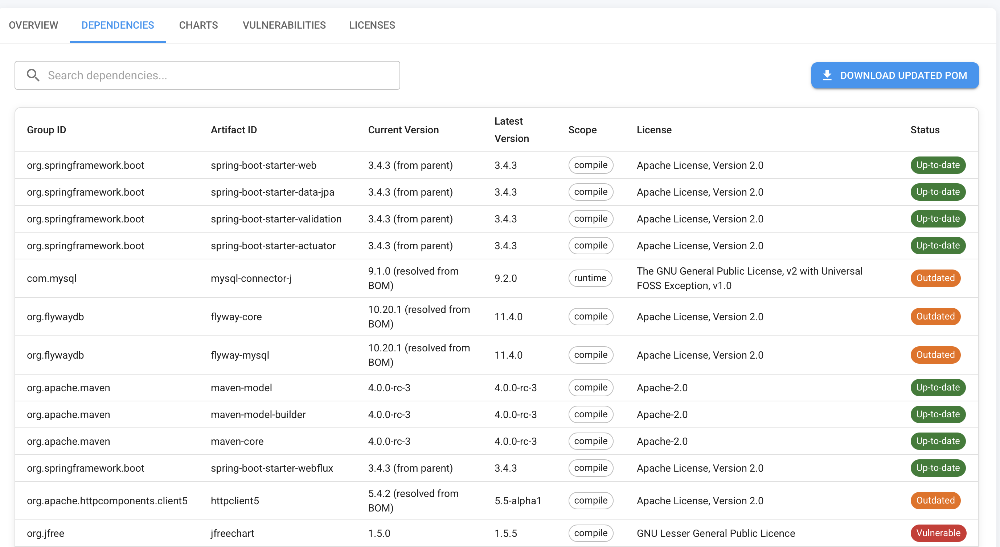
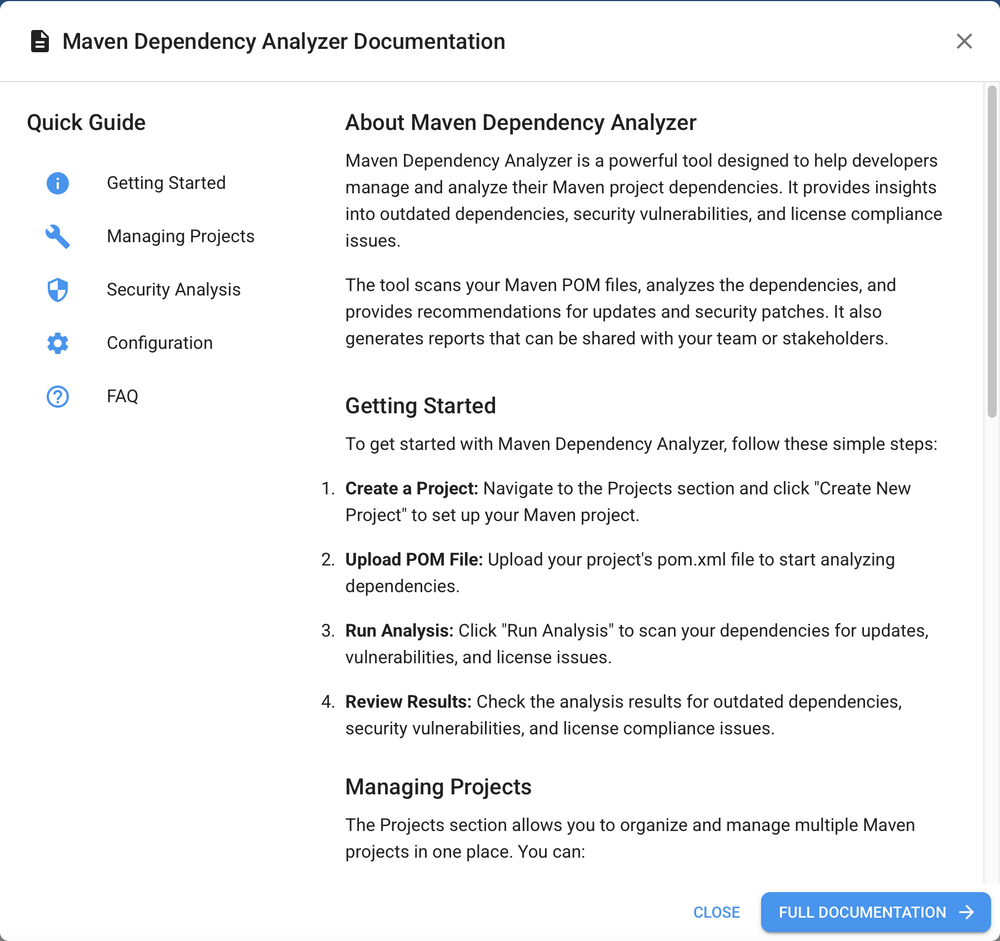
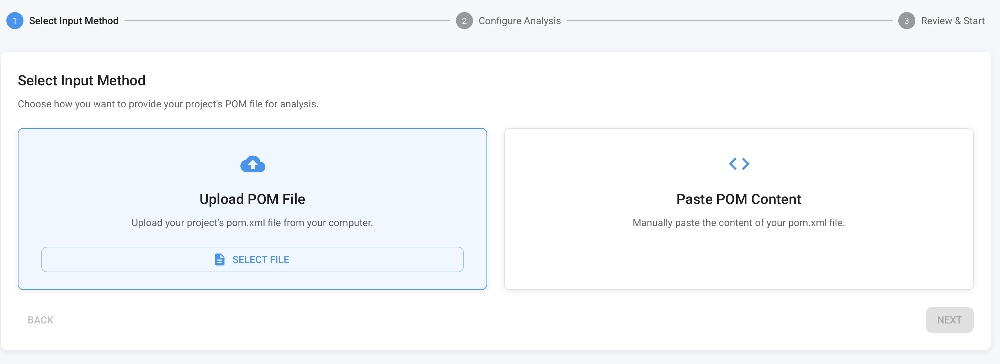
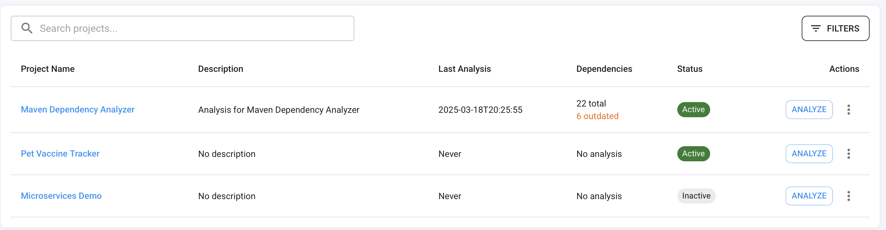
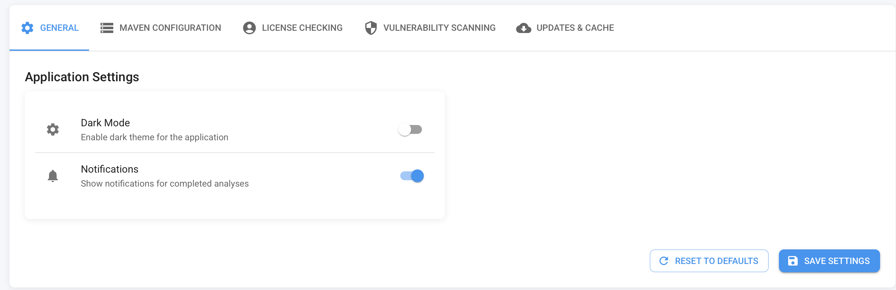
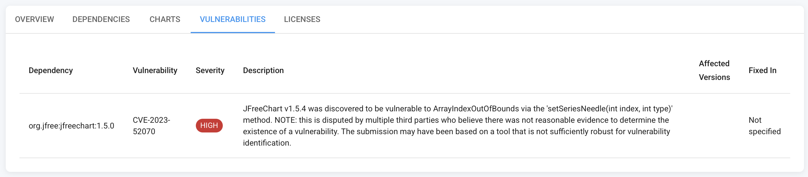

# Maven Dependency Analyzer

A tool for checking updates for Maven dependencies in POM files. This application helps you identify outdated dependencies, track dependency update history, and visualize dependency status through charts.

## Features

- **POM Dependency Analysis**: Parse and analyze dependencies in POM files
- **Dependency Update Check**: Identify outdated dependencies
- **Vulnerability Detection**: Identify potentially vulnerable dependencies
- **Historical Tracking**: Track dependency status changes over time
- **Visualization**: Generate charts to visualize dependency status
- **Project Management**: Organize analyses by projects
- **REST API**: Full-featured RESTful API for integration with other tools

## Technology Stack

- Java 21
- Spring Boot 3
- MySQL 8
- Redis
- JFreeChart
- Maven
- Docker

## Getting Started

### Prerequisites

- Java 21
- Docker and Docker Compose (for containerized deployment)

### Running in Hybrid Mode (Recommended for Local Development)

**This is the recommended approach for local development, especially when you need to analyze Maven projects on your local filesystem.**

The hybrid mode setup:
- UI, MySQL, and Redis run in Docker containers
- Backend runs locally, allowing it to access your local filesystem paths

Steps to set up:

1. Run UI, MySQL, and Redis with Docker Compose:
   ```
   docker compose up -d
   ```

2. Run the backend locally:
   ```
   ./mvnw spring-boot:run
   ```

Alternatively, you can use the convenience script:
   ```
   ./start-local.sh
   ```

3. Access the application:
   - API: http://localhost:8080/api
   - UI: http://localhost:3000
   - Swagger UI: http://localhost:8080/swagger-ui/index.html

**Important:** The backend needs to run locally (not in Docker) because it requires access to local filesystem paths for proper Maven project analysis. This allows you to analyze projects directly from your local machine.

## Usage Workflow

1. **Create Project**: Create a project to organize related analyses
2. **Upload/Paste POM**: Either upload a POM file or paste its content
3. **Configure Analysis**: Choose analysis options (vulnerability checks, transitive dependencies, etc.)
4. **View Results**: See dependency status, available updates, and potential vulnerabilities
5. **Generate Reports**: Create visual reports of dependency status

## API Endpoints

### Project Management

| Method | Endpoint | Description |
|--------|----------|-------------|
| POST | `/api/projects` | Create a new project |
| GET | `/api/projects` | Get all projects |
| GET | `/api/projects/{id}` | Get a project by ID |
| GET | `/api/projects/name/{name}` | Get a project by name |
| PUT | `/api/projects/{id}` | Update a project |
| DELETE | `/api/projects/{id}` | Delete a project |

### Dependency Analysis

| Method | Endpoint | Description |
|--------|----------|-------------|
| POST | `/api/analyses` | Analyze dependencies in a POM file |
| GET | `/api/analyses/{id}` | Get analysis results by ID |
| GET | `/api/analyses/project/{projectId}` | Get analysis history for a project |
| GET | `/api/analyses/project/{projectId}/latest` | Get the latest analysis for a project |
| DELETE | `/api/analyses/{id}` | Delete an analysis |

## Usage Examples

### Creating a Project

```bash
curl -X POST 'http://localhost:8080/api/projects' \
  -H 'Content-Type: application/json' \
  -d '{
    "name": "My Project",
    "description": "Sample project for testing"
  }'
```

### Analyzing Dependencies

```bash
curl -X POST 'http://localhost:8080/api/analyses' \
  -H 'Content-Type: application/json' \
  -d '{
    "projectId": 1,
    "pomContent": "<?xml version=\"1.0\" encoding=\"UTF-8\"?><project>...</project>",
    "checkVulnerabilities": true,
    "pomDirectoryPath": "/optional/path/to/project" 
  }'
```

### Getting Analysis History

```bash
curl -X GET 'http://localhost:8080/api/analyses/project/1'
```

## How It Works

1. **POM Handling**: Can use paths to existing projects
2. **POM Parsing**: Extracts dependency information including versions
3. **Version Checking**: Uses the Maven Repository API to check for newer versions
4. **Analysis**: Categorizes dependencies as up-to-date, outdated, or unidentified
5. **Vulnerability Scanning**: Checks dependencies against known vulnerabilities
6. **Visualization**: Generates charts showing the distribution of dependency statuses
7. **Notification**: Can send notifications when analysis completes

## License

This project is licensed under the MIT License - see the LICENSE file for details.


















